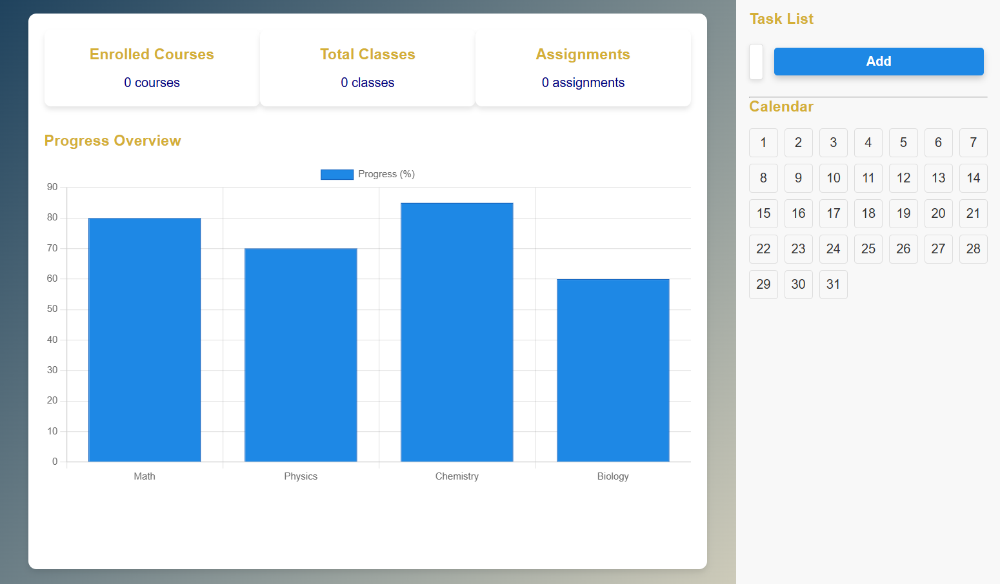
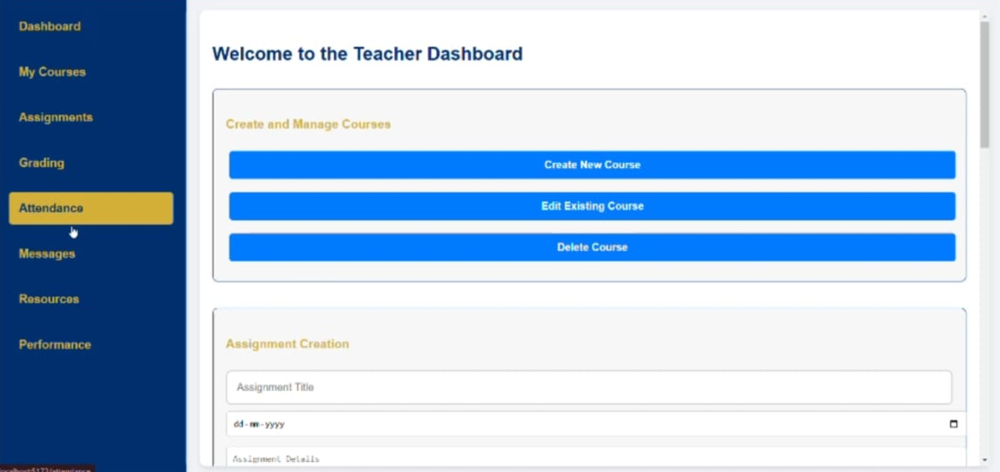
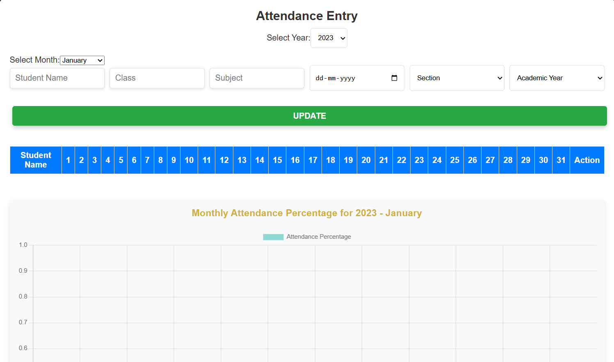
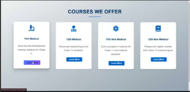
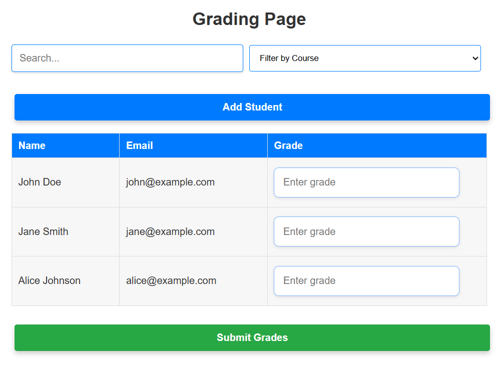
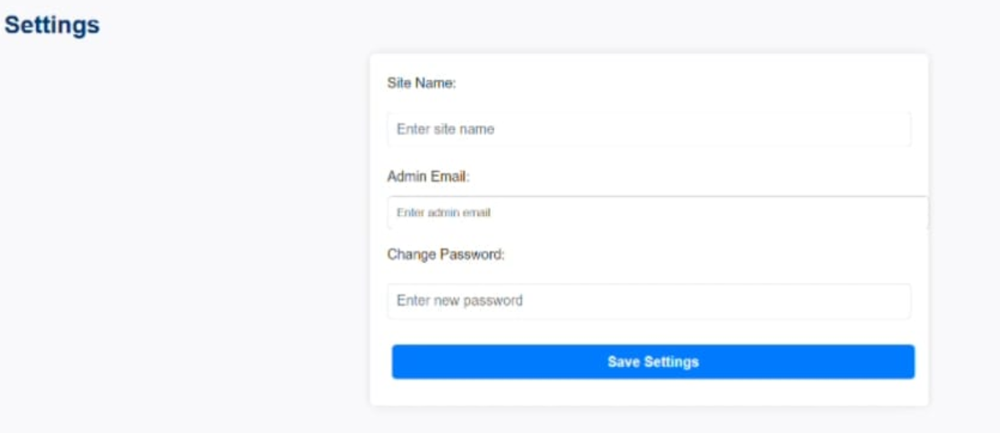

📘 Digital Learning Management System (LMS)
Tech Stack: React.js, Node.js, Express.js, MongoDB, JWT, Chart.js

Description:
Designed and developed a full-stack Learning Management System (LMS) using the MERN stack with secure multi-role authentication and real-time student-teacher interaction.

Key Features:

🔐 Role-Based Authentication: Implemented secure login and access control for Students, Teachers, and Admin using JWT.

📊 Dynamic Dashboards:

Students: View attendance, submit assignments, track academic performance.

Teachers: Manage attendance, upload assignments, grade student work.

Admin: Manage users, monitor system activity, moderate content.

📥 Assignment Submission Portal: Developed a submission system with automatic notifications and status updates.

📈 Performance Analytics: Integrated Chart.js to visualize student performance, attendance trends, and grading insights.

Impact:
Created a scalable, user-friendly platform to streamline academic workflows, enhance communication, and centralize student progress tracking.

## 🖼️ LMS Application Screenshots

### 🏠 Homepage

### 🧑‍💼 Role Selection

### 🎓 Student Dashboard

### 👩‍🏫 Teacher Dashboard

### 📅 Attendance Entry

### 📚 Courses Page

### 📝 Grading Panel

### ⚙️ Settings Page

